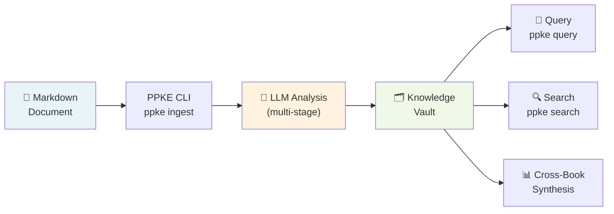
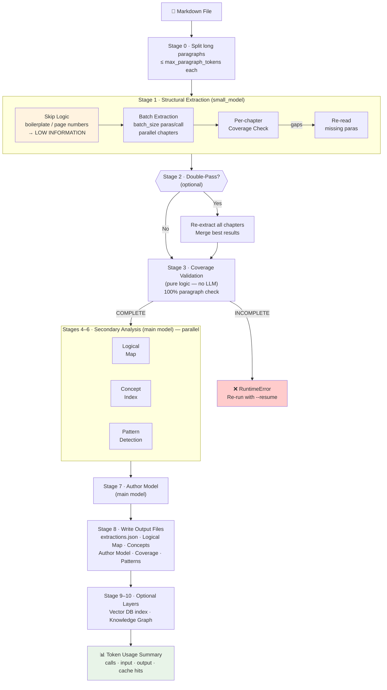
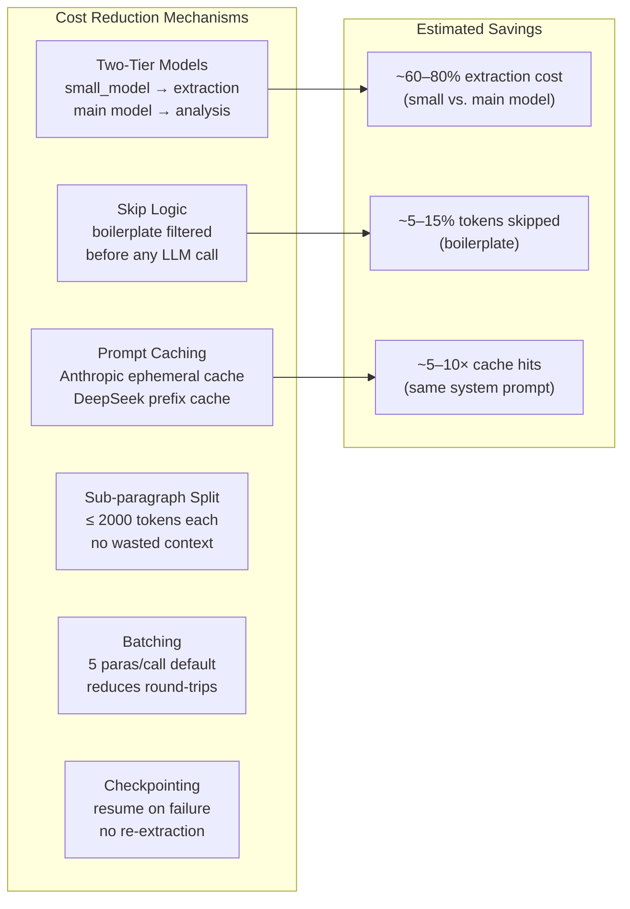

# PPKE - Personal & Professional Knowledge Engine

**Extract deep insights from any domain**: philosophy, legal, scientific, and more.

PPKE is a CLI tool for structured knowledge extraction from text documents. Using LLMs and a flexible template system, PPKE analyzes books and documents across multiple domains, extracting their logical structure and building a queryable knowledge base with full verbatim fidelity.

## 🌟 What's New in v2.0

**Multi-Domain Support**: PPKE v2.0 is now domain-agnostic! Analyze texts from any field while maintaining 100% backward compatibility for philosophy.

- **Philosophy** (default) - Argument mapping, concept tracking, logical structure
- **Legal** - Case law, statutory analysis, legal standards
- **Scientific** - Methodology, findings, research questions (community template)
- **Custom Domains** - Create your own templates ([Guide](PLUGINS.md))

## Features

- **Multi-Domain Analysis** - Use different templates for philosophy, legal, scientific, or custom domains
- **Structural Extraction** - Parses documents into chapters and paragraphs, extracts domain-specific insights via LLM
- **Two-Tier LLM Architecture** - Uses a configurable fast/cheap `small_model` (e.g. `gpt-4o-mini`, `claude-3-haiku`) for extraction (Skill 1) and the main model for deep analysis (Skills 3–7), reducing cost and latency
- **Skip Logic** - Automatically skips boilerplate, page numbers, and single-word paragraphs before LLM extraction, saving tokens on non-informative content
- **Sub-Paragraph Splitting** - Automatically splits long paragraphs into sub-paragraphs (`{03}.p12.1`, `{03}.p12.2`) when they exceed token limits
- **Parallel Extraction** - Multi-threaded chapter extraction for faster ingestion of large books
- **Parallel Analysis** - Logical architecture (Skill 3), Concept indexing (Skill 4), and Pattern detection (Skill 5) run concurrently via `ThreadPoolExecutor`, cutting wall-clock time for the analysis phase
- **Prompt Caching** - Anthropic system prompts are marked with `cache_control: {"type": "ephemeral"}` to activate the Anthropic prompt cache (up to 5-min TTL, significant token savings on repeated calls). DeepSeek applies prefix caching by default.
- **Resumable Ingestion** - Checkpoints saved after each chapter; resume from where you left off with `--resume` if ingestion fails
- **Exponential Backoff** - Automatic retry with 2s/4s/8s/16s backoff on rate-limit (429) and server errors (5xx)
- **Coverage Validation** - Ensures 100% paragraph coverage with automatic re-read on gaps
- **Interactive Re-Read** - User-triggered re-scan of specific chapters after ingestion
- **Logical Architecture** - Maps argument chains and inferential connections across chapters
- **Concept Indexing** - Tracks concept definitions, evolution, and cross-references
- **Semantic Deduplication** - Master Concept Index groups semantically equivalent concepts across books using LLM matching (not just string matching)
- **Pattern Detection** - Identifies rhetorical strategies, dialectical tensions, and recurring structures (written to `06_Patterns.md`)
- **Cross-Book Synthesis** - Compares and contrasts ideas across multiple encoded books
- **Single-Book Querying** - Ask questions about any ingested book with verbatim evidence
- **Vault Management** - List books, view statistics, and search across all extractions locally
- **Quick Reference** - `ppke cheat` prints a formatted cheat sheet of all 15 commands with descriptions and examples
- **Setup Diagnostics** - `ppke doctor` checks API key, vault directory, incomplete ingestions, and pending checkpoints at a glance
- **Research Notebook** - Queries and cross-queries are automatically logged to `RESEARCH_NOTEBOOK.md`; browse with `ppke notebook`
- **Interactive Menu** - `ppke menu` guides you through command selection step by step, shows the equivalent CLI command, and optionally executes it
- **Terminal Dashboard** - `ppke tui` provides a live browsable view of all books, quick search, and vault stats

## Quick Start

### 1. Install

```bash
pip install -e .
```

### 2. First-Time Setup

Run the setup wizard on first launch:

```bash
ppke init
```

This will walk you through:
- Choosing your LLM provider (Anthropic, OpenAI, DeepSeek, Gemini, or OpenRouter)
- Entering your API key (stored securely in `~/.ppke/.env` with `chmod 600`)
- Setting the knowledge base directory
- Configuring batch size

If you just run `ppke` without any command on a fresh install, the setup wizard starts automatically.

### 3. Ingest a Document

**Philosophy** (default domain):
```bash
ppke ingest book.md --title "Being and Time" --author "Heidegger" --year 1927
```

**Legal document**:
```bash
ppke ingest --domain legal contract.md --title "Software License Agreement" --author "Acme Corp" --year 2026
```

**Scientific paper**:
```bash
ppke ingest --domain scientific_research paper.md --title "Machine Learning Study" --author "Smith et al" --year 2026
```

Long paragraphs are automatically split into sub-paragraphs. Chapters are extracted in parallel for faster processing. If ingestion fails partway through, resume with `--resume`:

```bash
ppke ingest book.md --title "Being and Time" --author "Heidegger" --year 1927 --resume
```

### 4. Query

```bash
# Single book
ppke query --book "Book_Being_and_Time_Heidegger_1927" --question "What is Dasein?"

# Across all books
ppke cross-query --question "How do these authors differ on free will?"
```

### 5. Explore Available Domains

```bash
# List all available domain templates
ppke list-domains

# Validate a custom domain template
ppke validate-plugin path/to/your/template/
```

### 6. Explore Your Knowledge Base

```bash
# List all ingested books (across all domains)
ppke list

# View vault-wide statistics
ppke stats

# Search across all extracted paragraphs (local, no LLM)
ppke search "Dasein"
ppke search "strict scrutiny" --book "Book_Legal_Contract_Corp_2026"
```

### 7. Re-Read Specific Chapters

```bash
ppke re-read --book "Book_Being_and_Time_Heidegger_1927" --chapters "1,3,5"
```

## Commands

| Command | Description |
|---------|-------------|
| `ppke init` | First-time setup wizard (API keys, provider, vault path) |
| `ppke ingest <file>` | Ingest a document (use `--domain` to specify template, defaults to philosophy) |
| `ppke list-domains` | List all available domain templates |
| `ppke validate-plugin <path>` | Validate a custom domain template |
| `ppke parse <file>` | Dry-run parse (shows structure, no LLM calls) |
| `ppke query` | Query a single ingested book |
| `ppke cross-query` | Query across all ingested books |
| `ppke re-read` | Re-extract specific chapters from an ingested book |
| `ppke list` | List all ingested books with metadata |
| `ppke stats` | Show vault-wide statistics (books, chapters, coverage) |
| `ppke search <text>` | Full-text search across all extractions (no LLM) |
| `ppke config` | View or update configuration |
| `ppke cheat` | Print a quick-reference cheat sheet for all commands |
| `ppke doctor` | Run diagnostic checks (API key, vault, checkpoints) |
| `ppke notebook` | View or clear the auto-generated research log |
| `ppke menu` | Interactive guided menu for running any command |
| `ppke tui` | Launch an interactive terminal dashboard |

## Configuration

### Setup Wizard (`ppke init`)

The recommended way to configure PPKE. Interactively prompts for all settings and securely stores API keys.

### Manual Configuration

**API keys** - set via environment variables or `~/.ppke/.env`:

```bash
# Option A: environment variable
export ANTHROPIC_API_KEY=sk-ant-...

# Option B: stored in ~/.ppke/.env (created by ppke init)
# File is chmod 600, never committed to git
```

**Settings** - view and update via CLI:

```bash
ppke config --show
ppke config --provider anthropic --model claude-sonnet-4-20250514
ppke config --small-model claude-3-haiku-20240307   # two-tier: cheap model for extraction
ppke config --vault-path ~/my-vault
ppke config --batch-size 10
```

Config file: `~/.ppke/config.json`

### Options for `ppke ingest`

| Flag | Description |
|------|-------------|
| `--title` | Book title (required) |
| `--author` | Book author (required) |
| `--year` | Publication year |
| `--provider` | Override LLM provider (`anthropic` / `openai` / `deepseek` / `gemini` / `openrouter`) |
| `--model` | Override main model name |
| `--vault-path` | Override output directory |
| `--batch-size` | Paragraphs per LLM batch |
| `--operator` | Human operator name for versioning |
| `--double-pass` | Enable double-pass extraction for verification |
| `--resume` | Resume from last checkpoint if a previous run failed |
| `-v, --verbose` | Verbose logging |

### Advanced Config Options

| Setting | Default | Description |
|---------|---------|-------------|
| `model` | provider-specific | Main model used for deep analysis (Skills 3–7) |
| `small_model` | provider-specific | Cheap/fast model for extraction (Skill 1). Defaults: `claude-3-haiku-20240307` (Anthropic), `gpt-4o-mini` (OpenAI), `deepseek-chat` (DeepSeek), `gemini-1.5-flash` (Gemini) |
| `max_paragraph_tokens` | 2000 | Split paragraphs exceeding this token count |
| `max_workers` | 4 | Parallel extraction threads (Skill 1) |
| `paragraphs_per_batch` | 5 | Paragraphs sent per LLM call |

### Cost Optimisation

PPKE uses several mechanisms to reduce token cost and latency:

1. **Two-Tier Models** — Set `small_model` to a cheaper model for extraction. The main `model` is reserved for logical mapping, concept indexing, and pattern detection.
2. **Skip Logic** — Paragraphs consisting of a single word, bare page numbers (digits/roman numerals), or common boilerplate phrases (e.g. "All rights reserved", "ISBN", "Bibliography") are skipped entirely before any LLM call and given a `[LOW INFORMATION]` placeholder. This saves tokens on content that carries no philosophical argument.
3. **Anthropic Prompt Caching** — All system prompts sent to Anthropic are tagged with `cache_control: {"type": "ephemeral"}`. Repeated calls with the same large system prompt hit the cache rather than re-encoding, saving input tokens (typically 5-10×).
4. **DeepSeek Prefix Caching** — DeepSeek applies context-prefix caching automatically for repeated prefixes; no extra configuration is needed.
5. **Parallel Analysis** — Skills 3 (Logical Map), 4 (Concept Index), and 5 (Pattern Detection) run simultaneously in a `ThreadPoolExecutor`, so the analysis phase takes roughly the time of the slowest skill rather than the sum.

## Usability Tools

### Quick Reference (`ppke cheat`)

Prints a formatted table of all 15 PPKE commands with descriptions and usage examples.

```bash
ppke cheat
```

### Diagnostics (`ppke doctor`)

Checks your setup and surfaces any problems: config file presence, API key for the active provider, vault directory accessibility, books with incomplete ingestion, and pending checkpoints.

```bash
ppke doctor
ppke doctor --vault-path ~/my-vault
```

### Research Notebook (`ppke notebook`)

`ppke query` and `ppke cross-query` automatically append each question, answer, and evidence quotes to `RESEARCH_NOTEBOOK.md` in the vault root. Use `ppke notebook` to browse, tail, or clear the log.

```bash
ppke notebook               # View full log
ppke notebook --tail 5      # Show last 5 entries
ppke notebook --clear       # Delete the log
```

### Interactive Menu (`ppke menu`)

Numbered action menu. Select a command, answer prompts for its arguments, see the full equivalent CLI command in a panel, then optionally execute it directly.

```bash
ppke menu
```

### Terminal Dashboard (`ppke tui`)

Interactive terminal dashboard. Browse all books in a summary table, view detailed metadata and file status for a single book, run quick local searches, and view vault-wide statistics — all from one interface.

```bash
ppke tui
ppke tui --vault-path ~/my-vault
```

---

## Architecture & Pipeline

### High-Level Overview



### Ingestion Pipeline (Technical)



### Token Cost Architecture



PPKE processes a book through sequential pipeline stages:

```
Stage 0: Sub-paragraph splitting (token limit management)
Stage 1: Structural extraction  [small_model, parallel chapters, skip logic]
Stage 2: Double-pass (optional) [small_model]
Stage 3: Coverage validation    [pure logic, no LLM]
Stage 4: Logical architecture ──┐
Stage 5: Concept indexing       ├── parallel (ThreadPoolExecutor × 3)
Stage 6: Pattern detection    ──┘
Stage 7: Author model           [main model]
Stage 8: Write all output files
```

**Skill mapping:**
| Skill | Stage | Model tier | Notes |
|-------|-------|-----------|-------|
| Skill 1 – Extraction | Stage 1 | `small_model` | Per-chapter, parallelised; skip logic pre-filters low-info paras |
| Skill 2 – Validation | Stage 3 | none (logic) | Pure coverage check, no LLM |
| Skill 3 – Logical Map | Stage 4 | `model` | Runs in parallel with Skills 4 & 5 |
| Skill 4 – Concept Index | Stage 5 | `model` | Runs in parallel with Skills 3 & 5 |
| Skill 5 – Pattern Detection | Stage 6 | `model` | Runs in parallel with Skills 3 & 4 |
| Skill 6 – Cross-Book Synthesis | `cross-query` command | `model` | On-demand |

## Project Structure

```
ppke/
├── cli.py               # CLI entry point (Click) — all 15 commands
├── config.py            # Configuration & .env management (LLMConfig, small_model)
├── tui.py               # Terminal dashboard (ppke tui)
├── parser/
│   ├── models.py        # Data models (Book, Chapter, Paragraph, ExtractionResult, etc.)
│   └── markdown.py      # Markdown parsing + sub-paragraph splitting
├── llm/
│   ├── client.py        # Unified LLM client (Anthropic/OpenAI/DeepSeek/Gemini/OpenRouter)
│   │                    #   • model_override for two-tier architecture
│   │                    #   • Anthropic prompt caching (cache_control: ephemeral)
│   │                    #   • Exponential backoff retry (429 / 5xx)
│   └── prompts.py       # Prompt templates for all pipeline stages
├── pipeline/
│   ├── orchestrator.py  # Master controller
│   │                    #   • Skip logic (_is_low_information)
│   │                    #   • Parallel extraction (ThreadPoolExecutor)
│   │                    #   • Parallel analysis (Skills 3/4/5 concurrent)
│   │                    #   • Checkpoint save/resume
│   ├── extractor.py     # Skill 1: Structural extraction (model_override support)
│   ├── validator.py     # Skill 2: Coverage validation (pure logic)
│   ├── logical_map.py   # Skill 3: Logical architecture builder
│   ├── concepts.py      # Skill 4: Concept indexer (chunked)
│   ├── patterns.py      # Skill 5: Pattern & tension detector (chunked)
│   └── synthesizer.py   # Skill 6: Cross-book synthesizer
├── output/
│   └── writer.py        # File generation + semantic concept deduplication
└── tests/
    ├── test_parser.py
    ├── test_validator.py
    ├── test_splitter.py
    ├── test_new_features.py
    ├── test_security.py
    ├── test_coverage_boost.py
    ├── test_providers.py
    ├── test_loop2_coverage.py
    ├── test_orchestrator.py
    └── test_usability_commands.py  # cheat, doctor, notebook, menu, tui
```

## Output Structure

Each ingested book creates a folder in the vault:

```
~/KnowledgeBase/
├── 00_PROJECT_SETTINGS.md      # Global config
├── MASTER_CONCEPT_INDEX.md     # Cross-book concepts (semantically deduplicated)
├── QA_RESULTS.md               # Coverage status
├── PLAYBOOK.md                 # Usage guide
├── RESEARCH_NOTEBOOK.md        # Auto-generated query/answer log (ppke notebook)
└── Book_Being_and_Time_Heidegger_1927/
    ├── meta.yml                # Book metadata
    ├── extractions.json        # Raw extraction data (for re-read & search)
    ├── 01_Raw_Structure.md     # Full extraction
    ├── 02_Logical_Map.md       # Argument architecture
    ├── 03_Concept_Index.md     # Concept tracking
    ├── 04_Author_Model.md      # Author analysis
    ├── 05_Coverage_Report.md   # Validation report
    └── 06_Patterns.md          # Patterns & tensions
```

## Requirements

- Python >= 3.10
- An API key for at least one supported provider:
  - [Anthropic](https://console.anthropic.com/settings/keys) — recommended (best caching support)
  - [OpenAI](https://platform.openai.com/api-keys)
  - [DeepSeek](https://platform.deepseek.com/)
  - [Google Gemini](https://aistudio.google.com/app/apikey)
  - [OpenRouter](https://openrouter.ai/keys) (multi-provider gateway)

## Development

```bash
pip install -e ".[dev]"
pytest ppke/tests/
```

## License

Private project.

