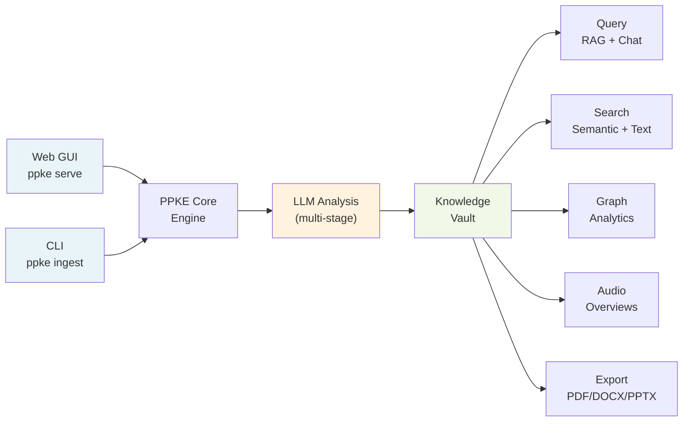
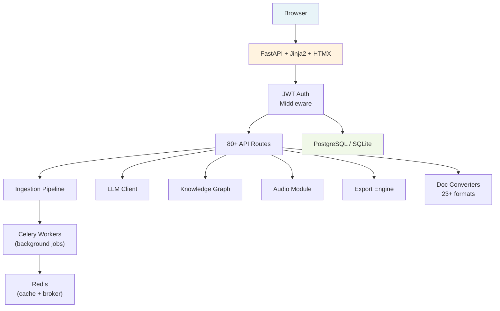
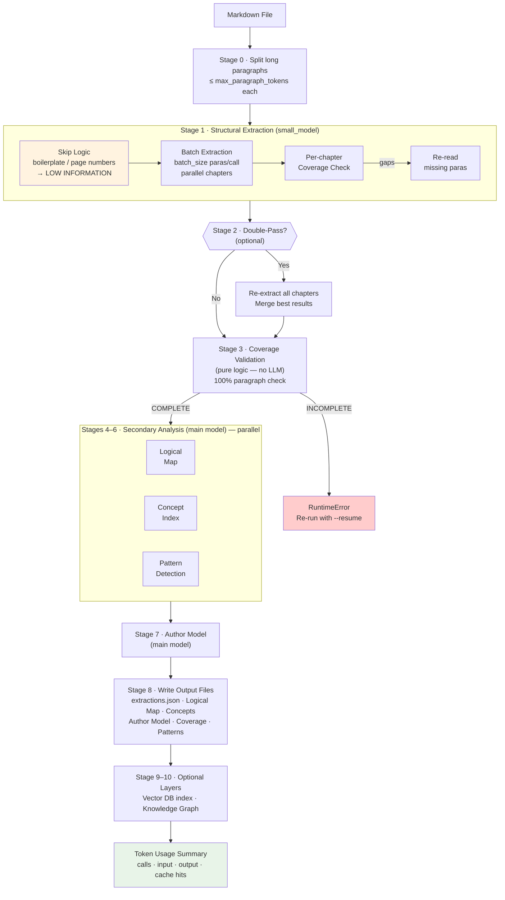
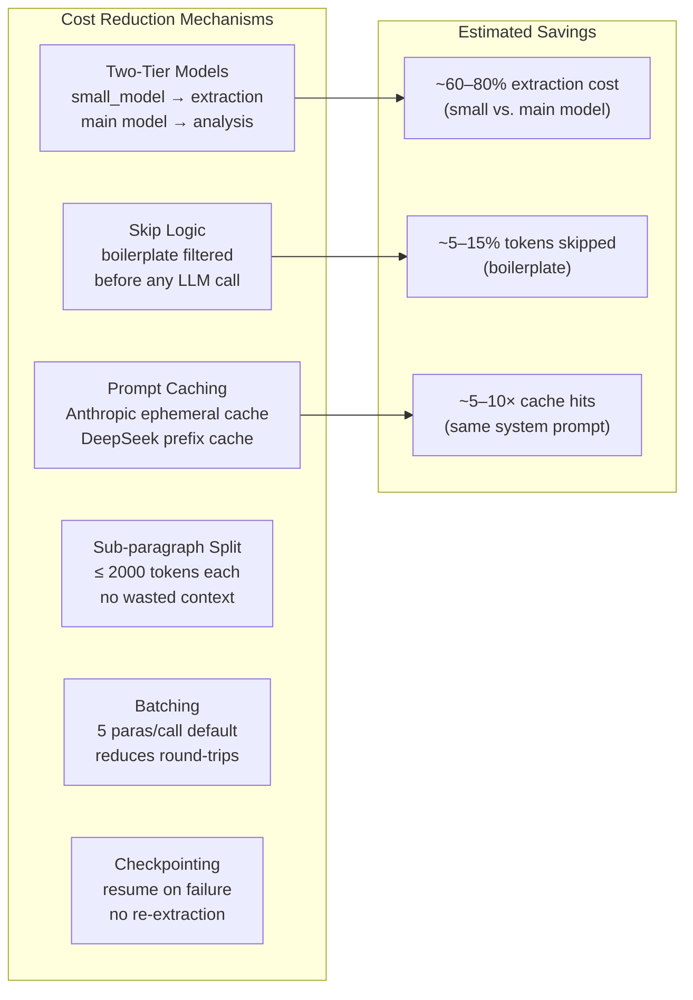

# PPKE — Personal & Professional Knowledge Engine

**Turn books and documents into a structured, queryable knowledge base.**

PPKE is an open-source CLI + Web platform that uses LLMs to extract, organize, and analyze knowledge from text documents. Upload a book, paper, or legal contract — PPKE parses it into chapters and paragraphs, extracts domain-specific insights, builds a concept graph, and lets you ask questions with verbatim evidence. Everything is accessible via the command line or a full-featured web interface.

> **License:** AGPL-3.0 & Commercial Enterprise License — see [DUAL-LICENSE.md](DUAL-LICENSE.md) for details.

## Key Capabilities

| Capability | Status | Details |
|------------|--------|---------|
| **Web GUI** | Working | Dark mode, responsive, SSE streaming, settings panel |
| **CLI** | Working | 15+ commands including `ingest`, `query`, `cross-query`, `tui` |
| **23+ format import** | Working | PDF, DOCX, EPUB, HTML, images (OCR), CSV, Excel, LaTeX (import only), ZIP |
| **URL & YouTube import** | Working | Web page scraping, YouTube transcript extraction |
| **AI Chat & RAG** | Working | Chat history, vector-enhanced queries, follow-up suggestions |
| **Content generation** | Working | Summaries, study guides, glossaries, flashcards |
| **Knowledge graph** | Working | Interactive D3.js visualization, clusters, path finder, gap/contradiction detection |
| **Obsidian export** | Working | ZIP of interlinked `[[wikilink]]` Markdown files (export only — no live sync) |
| **PDF/DOCX/PPTX export** | Working | Analysis reports exported as PDF, Word, or PowerPoint |
| **Audio overviews** | Working | Podcast-style audio summaries via TTS, cross-book episodes, RSS import |
| **Multi-user auth (JWT)** | Working | Registration/login, per-user vaults, workspaces, annotations |
| **Docker deployment** | Working | Docker Compose with Redis, PostgreSQL, Celery, Prometheus |
| **Bibliography** | Working | APA/MLA/Chicago formatted citations from book metadata |
| **Literature reviews** | Working | LLM-generated cross-book synthesis |
| **Argument maps** | Working | Claim/assumption/concept graph from extractions |
| **LaTeX/BibTeX export** | Working | Full `.tex` and `.bib` export via `export_latex()` / `export_bibtex()` in `ppke/export/exporters.py` |
| **OAuth login (Google/GitHub)** | Working (credentials required) | Full OAuth flow implemented; returns HTTP 501 only when `GOOGLE_CLIENT_ID` / `GITHUB_CLIENT_ID` env vars are not set |
| **Zotero import** | Working | Supports `.bib` (BibTeX), `.json` (CSL JSON), `.rdf` (Zotero RDF) via `ppke/converter/zotero.py` |
| **Deep Obsidian/PKM sync** | Working | `ObsidianSyncEngine` in `ppke/export/obsidian_sync.py`; incremental two-way sync via SHA-256 manifest; `sync_to_vault()`, `sync_from_vault()`, `full_sync()` |
| **Plugin marketplace** | Working | Catalog, rating, submission, and GitHub install all implemented; `ppke/templates/marketplace.py`; web UI at `/marketplace` |
| **Hybrid search** | Working | Weighted fusion of full-text (0.4) + vector (0.6); CLI `ppke hybrid-search`, `GET /api/search?mode=hybrid`; requires `ppke[vector]` for vector half |
| **Speaker diarization** | Working | Identifies 'who spoke when' via `pyannote.audio`; install with `pip install 'ppke[diarization]'` |
| **Test coverage** | ~91% | See [test-coverage.md](test-coverage.md) for the full breakdown |

## Features

## Quick Start

### Option A: Web Interface (Recommended)

```bash
# Install with web dependencies
pip install -e ".[web]"

# Start the web server
ppke serve
```

Open http://localhost:8000 in your browser. Upload documents, run queries, explore the knowledge graph, and manage settings \u2014 all from the GUI.

### Option B: CLI

#### 1. Install

```bash
pip install -e .
```

#### 2. First-Time Setup

Run the setup wizard on first launch:

```bash
ppke init
```

This will walk you through:
- Choosing your LLM provider (Anthropic, OpenAI, DeepSeek, Gemini, or OpenRouter)
- Entering your API key (stored securely in `~/.ppke/.env` with `chmod 600`)
- Setting the knowledge base directory
- Configuring batch size

If you just run `ppke` without any command on a fresh install, the setup wizard starts automatically.

### 3. Ingest a Document

**Philosophy** (default domain):
```bash
ppke ingest book.md --title "Being and Time" --author "Heidegger" --year 1927
```

**Legal document**:
```bash
ppke ingest --domain legal contract.md --title "Software License Agreement" --author "Acme Corp" --year 2026
```

**Scientific paper**:
```bash
ppke ingest --domain scientific_research paper.md --title "Machine Learning Study" --author "Smith et al" --year 2026
```

Long paragraphs are automatically split into sub-paragraphs. Chapters are extracted in parallel for faster processing. If ingestion fails partway through, resume with `--resume`:

```bash
ppke ingest book.md --title "Being and Time" --author "Heidegger" --year 1927 --resume
```

### 4. Query

```bash
# Single book
ppke query --book "Book_Being_and_Time_Heidegger_1927" --question "What is Dasein?"

# Across all books
ppke cross-query --question "How do these authors differ on free will?"
```

### 5. Explore Available Domains

```bash
# List all available domain templates
ppke list-domains

# Validate a custom domain template
ppke validate-plugin path/to/your/template/
```

### 6. Explore Your Knowledge Base

```bash
# List all ingested books (across all domains)
ppke list

# View vault-wide statistics
ppke stats

# Search across all extracted paragraphs (local, no LLM)
ppke search "Dasein"
ppke search "strict scrutiny" --book "Book_Legal_Contract_Corp_2026"
```

### 7. Re-Read Specific Chapters

```bash
ppke re-read --book "Book_Being_and_Time_Heidegger_1927" --chapters "1,3,5"
```

## Commands

| Command | Description |
|---------|-------------|
| `ppke serve` | **Start the web GUI** (opens at http://localhost:8000) |
| `ppke init` | First-time setup wizard (API keys, provider, vault path) |
| `ppke ingest <file>` | Ingest a document (use `--domain` to specify template, defaults to philosophy) |
| `ppke list-domains` | List all available domain templates |
| `ppke validate-plugin <path>` | Validate a custom domain template |
| `ppke parse <file>` | Dry-run parse (shows structure, no LLM calls) |
| `ppke query` | Query a single ingested book |
| `ppke cross-query` | Query across all ingested books |
| `ppke re-read` | Re-extract specific chapters from an ingested book |
| `ppke list` | List all ingested books with metadata |
| `ppke stats` | Show vault-wide statistics (books, chapters, coverage) |
| `ppke search <text>` | Full-text search across all extractions (no LLM) |
| `ppke config` | View or update configuration |
| `ppke cheat` | Print a quick-reference cheat sheet for all commands |
| `ppke doctor` | Run diagnostic checks (API key, vault, checkpoints) |
| `ppke notebook` | View or clear the auto-generated research log |
| `ppke menu` | Interactive guided menu for running any command |
| `ppke tui` | Launch an interactive terminal dashboard |

## Configuration

### Setup Wizard (`ppke init`)

The recommended way to configure PPKE. Interactively prompts for all settings and securely stores API keys.

### Manual Configuration

**API keys** - set via environment variables or `~/.ppke/.env`:

```bash
# Option A: environment variable
export ANTHROPIC_API_KEY=sk-ant-...

# Option B: stored in ~/.ppke/.env (created by ppke init)
# File is chmod 600, never committed to git
```

**Settings** - view and update via CLI:

```bash
ppke config --show
ppke config --provider anthropic --model claude-sonnet-4-20250514
ppke config --small-model claude-3-haiku-20240307   # two-tier: cheap model for extraction
ppke config --vault-path ~/my-vault
ppke config --batch-size 10
```

Config file: `~/.ppke/config.json`

### Options for `ppke ingest`

| Flag | Description |
|------|-------------|
| `--title` | Book title (required) |
| `--author` | Book author (required) |
| `--year` | Publication year |
| `--provider` | Override LLM provider (`anthropic` / `openai` / `deepseek` / `gemini` / `openrouter`) |
| `--model` | Override main model name |
| `--vault-path` | Override output directory |
| `--batch-size` | Paragraphs per LLM batch |
| `--operator` | Human operator name for versioning |
| `--double-pass` | Enable double-pass extraction for verification |
| `--resume` | Resume from last checkpoint if a previous run failed |
| `-v, --verbose` | Verbose logging |

### Advanced Config Options

| Setting | Default | Description |
|---------|---------|-------------|
| `model` | provider-specific | Main model used for deep analysis (Skills 3–7) |
| `small_model` | provider-specific | Cheap/fast model for extraction (Skill 1). Defaults: `claude-3-haiku-20240307` (Anthropic), `gpt-4o-mini` (OpenAI), `deepseek-chat` (DeepSeek), `gemini-1.5-flash` (Gemini) |
| `max_paragraph_tokens` | 2000 | Split paragraphs exceeding this token count |
| `max_workers` | 4 | Parallel extraction threads (Skill 1) |
| `paragraphs_per_batch` | 5 | Paragraphs sent per LLM call |

### Cost Optimisation

PPKE uses several mechanisms to reduce token cost and latency:

1. **Two-Tier Models** — Set `small_model` to a cheaper model for extraction. The main `model` is reserved for logical mapping, concept indexing, and pattern detection.
2. **Skip Logic** — Paragraphs consisting of a single word, bare page numbers (digits/roman numerals), or common boilerplate phrases (e.g. "All rights reserved", "ISBN", "Bibliography") are skipped entirely before any LLM call and given a `[LOW INFORMATION]` placeholder. This saves tokens on content that carries no philosophical argument.
3. **Anthropic Prompt Caching** — All system prompts sent to Anthropic are tagged with `cache_control: {"type": "ephemeral"}`. Repeated calls with the same large system prompt hit the cache rather than re-encoding, saving input tokens (typically 5-10×).
4. **DeepSeek Prefix Caching** — DeepSeek applies context-prefix caching automatically for repeated prefixes; no extra configuration is needed.
5. **Parallel Analysis** — Skills 3 (Logical Map), 4 (Concept Index), and 5 (Pattern Detection) run simultaneously in a `ThreadPoolExecutor`, so the analysis phase takes roughly the time of the slowest skill rather than the sum.

## Usability Tools

### Quick Reference (`ppke cheat`)

Prints a formatted table of all 15 PPKE commands with descriptions and usage examples.

```bash
ppke cheat
```

### Diagnostics (`ppke doctor`)

Checks your setup and surfaces any problems: config file presence, API key for the active provider, vault directory accessibility, books with incomplete ingestion, and pending checkpoints.

```bash
ppke doctor
ppke doctor --vault-path ~/my-vault
```

### Research Notebook (`ppke notebook`)

`ppke query` and `ppke cross-query` automatically append each question, answer, and evidence quotes to `RESEARCH_NOTEBOOK.md` in the vault root. Use `ppke notebook` to browse, tail, or clear the log.

```bash
ppke notebook               # View full log
ppke notebook --tail 5      # Show last 5 entries
ppke notebook --clear       # Delete the log
```

### Interactive Menu (`ppke menu`)

Numbered action menu. Select a command, answer prompts for its arguments, see the full equivalent CLI command in a panel, then optionally execute it directly.

```bash
ppke menu
```

### Terminal Dashboard (`ppke tui`)

Interactive terminal dashboard. Browse all books in a summary table, view detailed metadata and file status for a single book, run quick local searches, and view vault-wide statistics — all from one interface.

```bash
ppke tui
ppke tui --vault-path ~/my-vault
```

---

## Architecture & Pipeline

### High-Level Overview



### Web Architecture



### Ingestion Pipeline (Technical)



### Token Cost Architecture



PPKE processes a book through sequential pipeline stages:

```
Stage 0: Sub-paragraph splitting (token limit management)
Stage 1: Structural extraction  [small_model, parallel chapters, skip logic]
Stage 2: Double-pass (optional) [small_model]
Stage 3: Coverage validation    [pure logic, no LLM]
Stage 4: Logical architecture ──┐
Stage 5: Concept indexing       ├── parallel (ThreadPoolExecutor × 3)
Stage 6: Pattern detection    ──┘
Stage 7: Author model           [main model]
Stage 8: Write all output files
```

**Skill mapping:**
| Skill | Stage | Model tier | Notes |
|-------|-------|-----------|-------|
| Skill 1 – Extraction | Stage 1 | `small_model` | Per-chapter, parallelised; skip logic pre-filters low-info paras |
| Skill 2 – Validation | Stage 3 | none (logic) | Pure coverage check, no LLM |
| Skill 3 – Logical Map | Stage 4 | `model` | Runs in parallel with Skills 4 & 5 |
| Skill 4 – Concept Index | Stage 5 | `model` | Runs in parallel with Skills 3 & 5 |
| Skill 5 – Pattern Detection | Stage 6 | `model` | Runs in parallel with Skills 3 & 4 |
| Skill 6 – Cross-Book Synthesis | `cross-query` command | `model` | On-demand |

## Project Structure

```
ppke/
├── cli.py               # CLI entry point (Click)
├── config.py            # Configuration & .env management
├── tui.py               # Terminal dashboard (ppke tui)
├── web/
│   ├── app.py           # FastAPI web server (80+ routes)
│   ├── static/          # CSS, JS, favicon
│   └── templates/       # Jinja2 HTML templates
├── auth/
│   ├── database.py      # User/workspace/annotation storage
│   ├── deps.py          # FastAPI auth dependencies
│   └── jwt_auth.py      # JWT token management
├── converter/
│   ├── registry.py      # PDF, DOCX, EPUB, HTML converters
│   ├── ocr.py           # Image/PDF OCR (Tesseract + multi-script)
│   ├── url.py           # Web page → Markdown conversion
│   └── youtube.py       # YouTube transcript extraction
├── audio/
│   ├── overview.py      # Podcast-style audio generation
│   ├── rss.py           # Podcast RSS feed import
│   └── transcriber.py   # Whisper audio transcription
├── export/
│   ├── exporters.py     # PDF, DOCX, PPTX export
│   └── academic.py      # Bibliography, literature review, argument maps
├── graph/
│   ├── knowledge_graph.py  # Concept graph construction
│   └── analytics.py     # Graph analytics (clusters, paths, gaps)
├── infra/
│   ├── cache.py         # Redis/memory cache
│   ├── tasks.py         # Celery background tasks
│   ├── metrics.py       # Prometheus metrics
│   ├── sentry_integration.py  # Error tracking
│   ├── storage.py       # S3/GCS cloud storage
│   └── logging_config.py     # Structured logging
├── parser/
│   ├── models.py        # Pydantic data models
│   ├── markdown.py      # Markdown parsing + splitting
│   └── schema_builder.py  # Dynamic schema generation
├── llm/
│   ├── client.py        # Multi-provider LLM client
│   └── prompts.py       # Prompt templates
├── pipeline/
│   ├── orchestrator.py  # Master pipeline controller
│   ├── async_orchestrator.py  # Async pipeline variant
│   ├── extractor.py     # Structural extraction
│   ├── validator.py     # Coverage validation
│   ├── logical_map.py   # Logical architecture
│   ├── concepts.py      # Concept indexing
│   ├── patterns.py      # Pattern detection
│   └── synthesizer.py   # Cross-book synthesis
├── templates/           # Domain template system
├── vectordb/            # Vector database integration
├── output/
│   └── writer.py        # Output file generation
└── tests/               # Test suite (~91% coverage — see test-coverage.md)
```

## Output Structure

Each ingested book creates a folder in the vault:

```
~/KnowledgeBase/
├── 00_PROJECT_SETTINGS.md      # Global config
├── MASTER_CONCEPT_INDEX.md     # Cross-book concepts (semantically deduplicated)
├── QA_RESULTS.md               # Coverage status
├── PLAYBOOK.md                 # Usage guide
├── RESEARCH_NOTEBOOK.md        # Auto-generated query/answer log (ppke notebook)
└── Book_Being_and_Time_Heidegger_1927/
    ├── meta.yml                # Book metadata
    ├── extractions.json        # Raw extraction data (for re-read & search)
    ├── 01_Raw_Structure.md     # Full extraction
    ├── 02_Logical_Map.md       # Argument architecture
    ├── 03_Concept_Index.md     # Concept tracking
    ├── 04_Author_Model.md      # Author analysis
    ├── 05_Coverage_Report.md   # Validation report
    └── 06_Patterns.md          # Patterns & tensions
```

## Requirements

- Python >= 3.10
- An API key for at least one supported provider:
  - [Anthropic](https://console.anthropic.com/settings/keys) — recommended (best caching support)
  - [OpenAI](https://platform.openai.com/api-keys)
  - [DeepSeek](https://platform.deepseek.com/)
  - [Google Gemini](https://aistudio.google.com/app/apikey)
  - [OpenRouter](https://openrouter.ai/keys) (multi-provider gateway)

### Optional Dependencies

| Extra | Command | Features |
|-------|---------|----------|
| `web` | `pip install -e ".[web]"` | Web GUI (FastAPI, Jinja2, HTMX) |
| `ocr` | `pip install -e ".[ocr]"` | PDF/image OCR (PyMuPDF, Tesseract) |
| `audio` | `pip install -e ".[audio]"` | Audio generation & transcription |
| `dev` | `pip install -e ".[dev]"` | Testing & development tools |

### Docker Deployment

```bash
# Production deployment with PostgreSQL, Redis, Celery
docker-compose up -d
```

See [docker-compose.yml](docker-compose.yml) for the full stack configuration.

## Development

```bash
pip install -e ".[dev,web]"
pytest ppke/tests/
```

## License

Dual-licensed under **AGPL-3.0** and a **Commercial Enterprise License**.
See [DUAL-LICENSE.md](DUAL-LICENSE.md) for full terms.

## Not Yet Implemented

The following features are referenced in documentation or UI but are **not yet functional**:

| Feature | Current State | Code Reference |
|---------|--------------|----------------|
| OAuth login (Google/GitHub) | Working; set `GOOGLE_CLIENT_ID`/`GOOGLE_CLIENT_SECRET` or `GITHUB_CLIENT_ID`/`GITHUB_CLIENT_SECRET` env vars to enable | `ppke/web/app.py` (`/auth/oauth/{provider}`) |
| Zotero import | Working; supports `.bib`, `.json` (CSL JSON), `.rdf` | `ppke/converter/zotero.py`, `/api/import/zotero` |
| LaTeX/BibTeX export | Working; full `.tex` and `.bib` export implemented | `ppke/export/exporters.py` (`export_latex`, `export_bibtex`), `/api/export/latex`, `/api/export/bibtex` |
| Deep Obsidian/PKM sync | Working; `ObsidianSyncEngine` provides incremental two-way sync via SHA-256 content manifest | `ppke/export/obsidian_sync.py`, `web/app.py` (`/api/obsidian-sync/*`) |
| Plugin marketplace | Working; catalog, rating, submission, and GitHub install all implemented; no external hosted registry (local JSON catalog) | `ppke/templates/marketplace.py`, `ppke/templates/installer.py`, `web/app.py` (`/marketplace`, `/api/marketplace/*`) |
| Hybrid search (full-text + vector) | Working; weighted fusion in `ppke/search.py hybrid_search()`; requires `pip install 'ppke[vector]'` for vector half | `ppke/search.py` (`hybrid_search`), `ppke/cli.py` (`hybrid-search`), `web/app.py` (`/api/search?mode=hybrid`) |
| Speaker diarization | Implemented | `ppke/audio/diarization.py`; requires `pip install 'ppke[diarization]'` + HF token |
| Test coverage 90%+ | Currently ~91% | See [test-coverage.md](test-coverage.md) |

